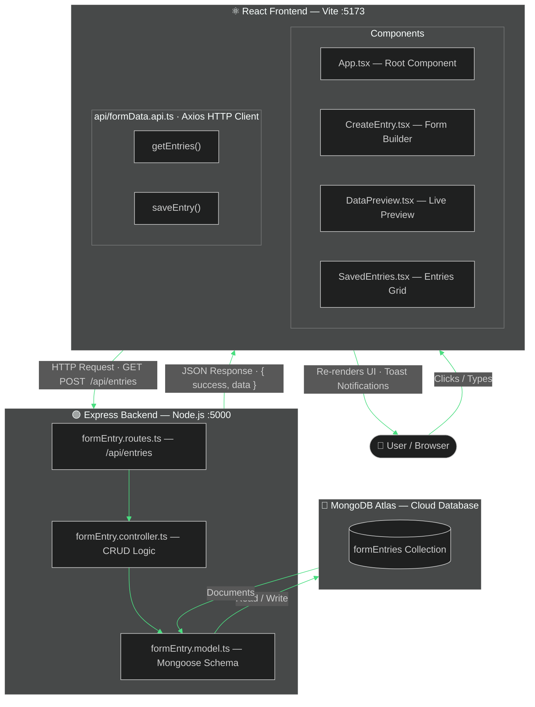
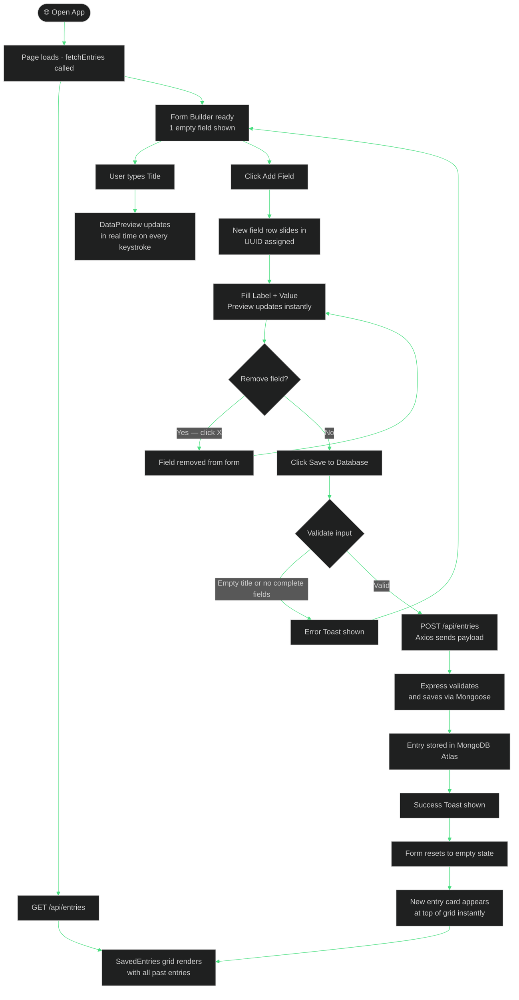

<div align="center">


<br/>


<br/>


<br/>

> A full-stack MERN application built for the **Supremus Angel Developer Assessment**.
> Users build dynamic forms, watch data render live in a preview panel, and persist entries to MongoDB — all in one seamless interface.

<br/>

[](https://supremus-angel-assessment.onrender.com)
[](https://github.com/Abhay-Pratap200001/Supremus-Angel-Assessment)

</div>

---

## 

| Requirement | Status | Implementation |
|:---|:---:|:---|
| Dynamic input fields — add & remove | ✅ | Inline in `CreateEntry.tsx` with `useState` |
| Real-time data render on screen | ✅ | `DataPreview` re-renders on every keystroke |
| Responsive — mobile, tablet, desktop | ✅ | Tailwind responsive grid (`lg:grid-cols-2`) |
| Hover effects / tooltips on rendered data | ✅ | Each preview row has hover highlight + `title` tooltip |
| Smooth animations & transitions | ✅ | `animate-slide-down` on new fields, `animate-fade-in` on preview |
| React.js + TypeScript *(bonus)* | ✅ | React 18 + TypeScript throughout both layers |
| Styling — Bootstrap or Styled Components | ✅ | Tailwind CSS — modern utility-first alternative |
| README with setup steps | ✅ | Full setup guide below |
| Proper folder structure & coding standards | ✅ | Separated `api` / `components` / `types` / `config` / `models` / `routes` / `controllers` |

---

## 

| Feature | Description |
|:---|:---|
| 🧱 **Dynamic Form Builder** | Add and remove label-value field pairs freely — unlimited fields per entry |
| 👁️ **Live Preview Panel** | Dedicated panel updates on every keystroke with a pulsing **LIVE** badge |
| 💾 **Save to MongoDB** | Completed forms saved permanently via REST API |
| 🗂️ **Saved Entries Grid** | All past entries loaded from the database on page open |
| 🎨 **Hover Effects & Tooltips** | Preview rows highlight on hover and show full data as tooltip |
| 🎞️ **Smooth Animations** | Fields slide in when added; preview fades in when content appears |
| 🔔 **Toast Notifications** | Success and error feedback via `react-hot-toast` with custom dark theme |
| 🌿 **Forest-Themed UI** | Dark green brand, gradient cards, nature icons (Lucide React) |
| 📱 **Fully Responsive** | Works on mobile, tablet, and desktop with no layout breakage |
| 🔒 **TypeScript End-to-End** | Full type safety across frontend components and backend API layers |

---

## 

<div align="center">


<br/>

### ⚛️ Frontend


### 🟢 Backend


### ☁️ DevOps


</div>

---

## 

```
supremus-angel/
│
├── 📂 backend/
│   ├── 📂 src/
│   │   ├── 📂 config/
│   │   │   └── db.ts                      # MongoDB connection via Mongoose
│   │   ├── 📂 controllers/
│   │   │   └── formEntry.controller.ts    # CRUD handlers — getall, create,
│   │   ├── 📂 models/
│   │   │   └── formEntry.model.ts         # Mongoose schema + IField / IFormEntry TypeScript interfaces
│   │   ├── 📂 routes/
│   │   │   └── formEntry.routes.ts        # Express router — maps HTTP verbs to controllers
│   │   └── index.ts                       # Entry point — middleware, routes, DB connect, server start
│   ├── package.json
│   └── tsconfig.json
│
├── 📂 frontend/
│   ├── 📂 src/
│   │   ├── 📂 api/
│   │   │   └── formData.api.ts            # All Axios calls in one place (getEntries, saveEntry)
│   │   ├── 📂 components/
│   │   │   ├── CreateEntry.tsx            # Form builder — form state, handlers and JSX all inline
│   │   │   ├── DataPreview.tsx            # Live preview panel — pure display component, props only
│   │   │   ├── SavedEntries.tsx           # Saved entries card grid — pure display, receives props
│   │   │   └── Navbar.tsx                 # Top navigation bar
│   │   ├── 📂 types/
│   │   │   └── index.ts                   # Shared TypeScript interfaces (Field, FormEntry, FormPayload)
│   │   ├── App.tsx                        # Root — loads entries from DB, renders layout
│   │   ├── index.css                      # Tailwind directives + custom scrollbar
│   │   └── main.tsx                       # React DOM render entry point
│   ├── tailwind.config.js                 # Custom animations (slide-down, fade-in)
│   ├── vite.config.ts                     # Dev proxy /api → localhost:5000
│   └── package.json
│
├── package.json                           # Root build + start scripts for Render
└── render.yaml                            # Render deployment blueprint
```

---

## 

### Prerequisites


### 1. Clone the repository

```bash
git clone https://github.com/Abhay-Pratap200001/Supremus-Angel-Assessment
cd Supremus-Angel-Assessment
```

### 2. Install dependencies

```bash
# Backend
cd backend && npm install

# Frontend (open a second terminal)
cd frontend && npm install
```

### 3. Configure environment variables

Create `backend/.env`:

```env
PORT=5000
MONGODB_URI=mongodb+srv://<username>:<password>@cluster.mongodb.net/supremus-angel
CLIENT_URL=http://localhost:5173
```

### 4. Run development servers

```bash
# Terminal 1 — Backend  →  http://localhost:5000
cd backend && npm run dev

# Terminal 2 — Frontend →  http://localhost:5173
cd frontend && npm run dev
```

---

## 

```bash
cd frontend && npm run build
cd backend && npm run build
NODE_ENV=production node dist/index.js
```

> In production, Express serves the compiled React build as static files — no separate frontend host needed.

---

## 

Base URL: `/api/entries`

| Method | Endpoint | Description | Body |
|:---:|:---|:---|:---|
|  | `/api/entries` | Fetch all saved entries | — |
|  | `/api/entries` | Create a new entry | `{ title, fields[] }` |
|  | `/health` | Server health check | — |

```json
{
  "title": "Employee Info",
  "fields": [
    { "label": "Name",       "value": "John Doe" },
    { "label": "Department", "value": "Engineering" },
    { "label": "Joined",     "value": "2024-01-15" }
  ]
}
```

---

## 

<div align="center">

</div>

<br/>

| Decision | Rationale |
|:---|:---|
| **Form state inline in `CreateEntry.tsx`** | Keeps all creation logic — state, handlers, JSX — in one file. Easy to read and modify without touching other components |
| **`DataPreview` as pure display component** | Receives `title` and `fields` as props with no internal logic. Straightforward to test and reuse anywhere |
| **Axios isolated in `api/formData.api.ts`** | Components never contain URLs or HTTP calls. Swap the backend without touching any UI file |
| **Tailwind CSS over Bootstrap** | Utility-first approach makes responsive layout and hover/animation states concise and co-located with JSX |
| **Custom animations in `tailwind.config.js`** | `animate-slide-down` for new fields and `animate-fade-in` for preview content satisfies the smooth transitions requirement |
| **`react-hot-toast`** | Zero-config notifications with custom dark-themed styles — no extra state management needed |
| **Mongoose `timestamps: true`** | Automatically adds `createdAt` / `updatedAt` to every document without any boilerplate |
| **Vite proxy `/api` → `:5000`** | Frontend uses relative URLs in both dev and production — no environment-specific URL config needed |
| **TypeScript on both layers** | Catches type mismatches between `FormPayload` (frontend) and `IFormEntry` (backend) at compile time, not runtime |
| **Separated backend folders** | `config` / `models` / `routes` / `controllers` — single responsibility per file, scalable as more resources are added |

---

## 

<div align="center">

</div>

<br/>

### System Architecture — How the App Works



---

### User Flow — Every Action Explained



---

## 

<div align="center">

</div>

<br/>

<div align="center">


</div>

---

<div align="center">


<br/>

**Built with 💚 by Abhay Pratap — Supremus Angel Developer Assessment**

<br/>


</div>


